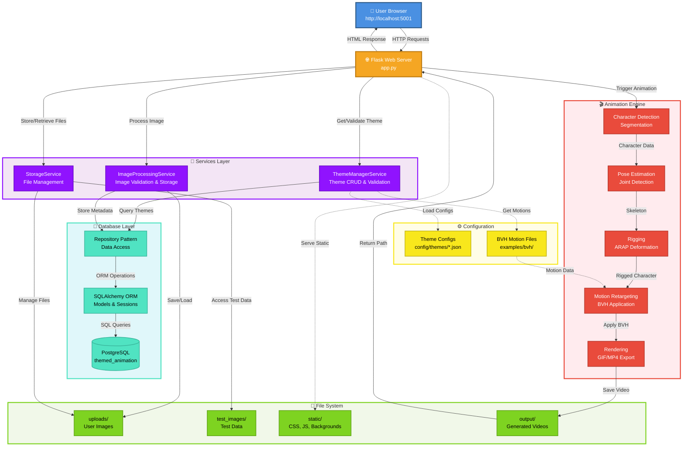
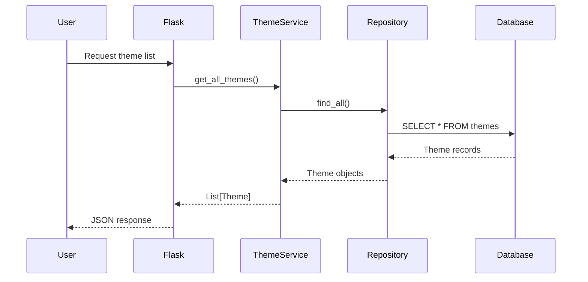
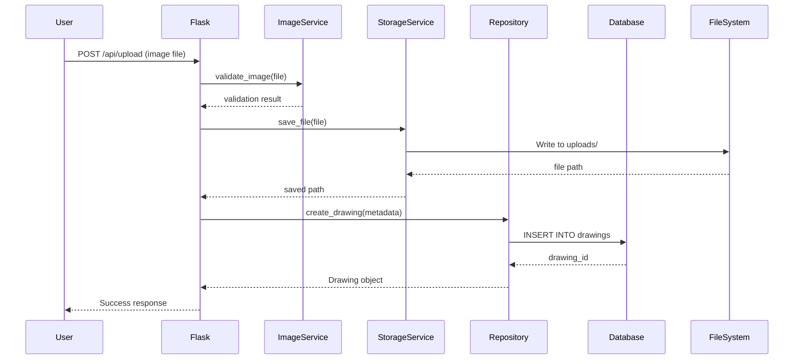
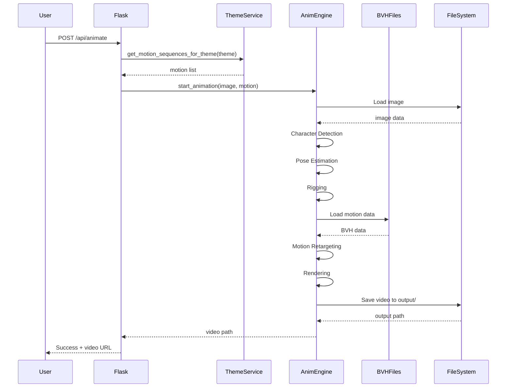
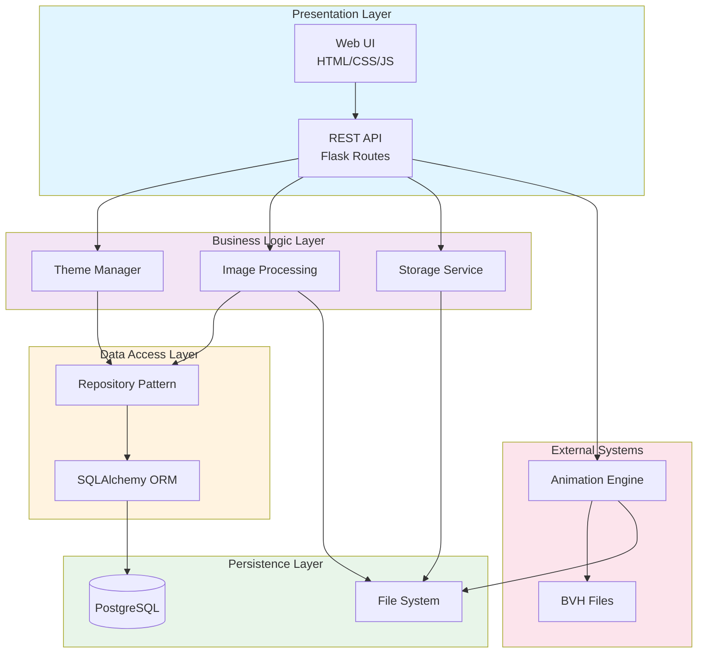
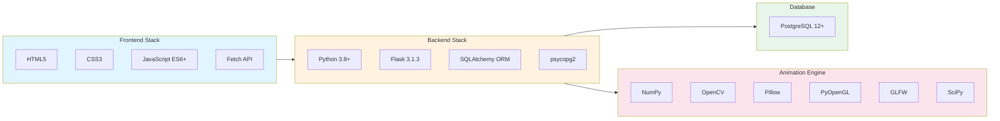

# 🏗️ Architecture Overview

## System Architecture Diagram



### Color Legend

| Color | Component Type | Description |
|-------|---------------|-------------|
| 🔵 Blue | User Layer | End-user interface (browser) |
| 🟠 Orange | API Layer | Flask web server and REST endpoints |
| 🟣 Purple | Services Layer | Business logic and orchestration |
| 🟢 Cyan | Database Layer | Data persistence and ORM |
| 🟡 Yellow | Configuration | Static configs and motion files |
| 🔴 Red | Animation Engine | Core animation processing pipeline |
| 🟢 Green | File System | File storage and management |

**Connection Types:**
- Solid arrows (→) - Direct data flow and method calls
- Dashed arrows (⋯→) - Configuration loading and reference access

## Data Flow Sequences

### 1. Theme Selection Flow


### 2. Image Upload & Processing Flow


### 3. Animation Generation Flow


## Component Breakdown

### Frontend Layer

**HTML (templates/index.html)**
- Main UI structure
- Mode toggle buttons
- Image display areas
- Upload interface
- Animation controls

**CSS (static/css/style.css)**
- Visual styling
- Responsive layout
- Animations & transitions
- Color scheme

**JavaScript (static/js/app.js)**
- User interactions
- API communication
- Dynamic UI updates
- File handling

### API Layer

**Flask Server (app.py)**
- HTTP request handling
- Route management
- File upload processing
- Mode configuration
- API responses
- Service orchestration

### Services Layer

**ThemeManagerService (services/theme_manager.py)**
- Theme CRUD operations
- Theme validation
- Default theme logic
- Theme-to-motion-sequence mapping
- Theme property retrieval

**ImageProcessingService (services/image_processing_service.py)**
- Image validation (format, size, dimensions)
- Image normalization
- Metadata extraction
- Storage coordination

**StorageService (services/storage_service.py)**
- File system operations
- Upload management
- Test image access
- Output file handling

### Database Layer

**SQLAlchemy ORM (database/orm.py)**
- ORM model definitions
- Session management
- Connection pooling
- Relationship mappings

**Repository Pattern (database/repository.py)**
- Data access abstraction
- CRUD operations
- Query optimization
- Transaction management

**PostgreSQL Database**
- Persistent data storage
- Relational integrity
- Indexed queries
- JSONB for flexible configs

### Configuration Layer

**Theme Configurations (config/themes/*.json)**
- Theme definitions (6 themes)
- Positioning rules
- Motion sequence mappings
- Visual properties

**BVH Motion Files (examples/bvh/)**
- Motion capture data
- Animation sequences
- Character movements

### Animation Engine

**Facebook Animated Drawings**
- Character detection & segmentation
- Pose estimation & joint detection
- Rigging with ARAP deformation
- Motion retargeting from BVH
- Frame rendering & video export

## Layered Architecture



## Mode Architecture

### Testing Mode
```
┌─────────────────┐
│  User Browser   │
└────────┬────────┘
         │
         │ Select test image
         │
┌────────▼────────┐
│  test_images/   │
│  • garlic.png   │
└────────┬────────┘
         │
         │ Process
         │
┌────────▼────────┐
│ Animation Core  │
└────────┬────────┘
         │
         │ Output
         │
┌────────▼────────┐
│   video.gif     │
└─────────────────┘
```

### Production Mode
```
┌─────────────────┐
│  User Browser   │
└────────┬────────┘
         │
         │ Upload image
         │
┌────────▼────────┐
│   uploads/      │
│  • user1.png    │
└────────┬────────┘
         │
         │ Process
         │
┌────────▼────────┐
│ Animation Core  │
└────────┬────────┘
         │
         │ Output
         │
┌────────▼────────┐
│   video.gif     │
└─────────────────┘
```

## API Endpoints

### GET /
Returns the main HTML page

### GET /api/mode
```json
Response: {
  "mode": "testing" | "production"
}
```

### GET /api/test-images
```json
Response: {
  "images": [
    {
      "name": "garlic.png",
      "path": "test_images/garlic.png"
    }
  ]
}
```

### POST /api/upload
```
Request: multipart/form-data with file
Response: {
  "success": true,
  "filename": "image.png",
  "message": "File uploaded successfully"
}
```

### POST /api/animate
```json
Request: {
  "image_path": "test_images/garlic.png",
  "motion": "dab"
}

Response: {
  "success": true,
  "message": "Animation started",
  "output": "video.gif"
}
```

## Technology Stack



### Stack Details

**Frontend Technologies:**
- HTML5 - Semantic markup
- CSS3 - Gradients, Flexbox, Grid
- Vanilla JavaScript (ES6+) - No framework dependencies
- Fetch API - Async HTTP requests

**Backend Technologies:**
- Python 3.8+ - Core language
- Flask 3.1.3 - Web framework
- SQLAlchemy - ORM and database toolkit
- psycopg2 - PostgreSQL adapter
- Werkzeug - File handling utilities

**Database:**
- PostgreSQL 12+ - Relational database
- JSONB - Flexible configuration storage
- Connection pooling - Performance optimization

**Animation Engine:**
- NumPy - Mathematical operations
- OpenCV - Image processing
- Pillow - Image handling
- PyOpenGL - 3D rendering
- GLFW - Window management
- SciPy - Scientific computing
- Scikit-image - Advanced image processing
- Shapely - Geometric operations

## Security Considerations

1. **File Upload Validation**
   - File type checking
   - Size limits (16MB)
   - Secure filename handling

2. **Path Security**
   - No directory traversal
   - Sandboxed upload folder
   - Validated file paths

3. **Input Sanitization**
   - JSON validation
   - Parameter checking
   - Error handling

## Performance Considerations

1. **File Handling**
   - Streaming uploads
   - Temporary storage
   - Cleanup routines

2. **Animation Processing**
   - Background processing (future)
   - Progress tracking (future)
   - Queue management (future)

3. **Caching**
   - Static file caching
   - Result caching (future)

## Scalability Path

### Current (Single User)
```
User → Flask Dev Server → Local Processing
```

### Future (Multi User)
```
Users → Load Balancer → Flask Servers → Task Queue → Workers
                                              ↓
                                         Database
                                              ↓
                                      File Storage
```

## Deployment Options

### Development
```bash
python app.py
# Flask development server
# Debug mode enabled
# Auto-reload on changes
```

### Production (Future)
```bash
gunicorn -w 4 -b 0.0.0.0:5001 app:app
# Multiple workers
# Production WSGI server
# Better performance
```

## Monitoring Points

1. **Server Health**
   - Uptime
   - Response times
   - Error rates

2. **File System**
   - Upload folder size
   - Disk space
   - File cleanup

3. **Processing**
   - Animation queue length
   - Processing times
   - Success/failure rates

---

**Architecture Version:** 1.0
**Last Updated:** March 2026
