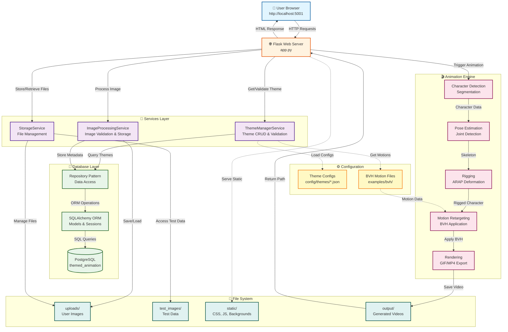

# 🏗️ Architecture Overview

## System Architecture Diagram



## Component Breakdown

### Frontend Layer

**HTML (templates/index.html)**
- Main UI structure
- Mode toggle buttons
- Image display areas
- Upload interface
- Animation controls

**CSS (static/css/style.css)**
- Visual styling
- Responsive layout
- Animations & transitions
- Color scheme

**JavaScript (static/js/app.js)**
- User interactions
- API communication
- Dynamic UI updates
- File handling

### Backend Layer

**Flask Server (app.py)**
- HTTP request handling
- Route management
- File upload processing
- Mode configuration
- API responses

### Data Flow

```
User Action → Frontend JS → API Request → Flask Server
                                              ↓
                                         File System
                                              ↓
                                    Animation Engine
                                              ↓
                                         Output File
                                              ↓
                                    Response to User
```

## Mode Architecture

### Testing Mode
```
┌─────────────────┐
│  User Browser   │
└────────┬────────┘
         │
         │ Select test image
         │
┌────────▼────────┐
│  test_images/   │
│  • garlic.png   │
└────────┬────────┘
         │
         │ Process
         │
┌────────▼────────┐
│ Animation Core  │
└────────┬────────┘
         │
         │ Output
         │
┌────────▼────────┐
│   video.gif     │
└─────────────────┘
```

### Production Mode
```
┌─────────────────┐
│  User Browser   │
└────────┬────────┘
         │
         │ Upload image
         │
┌────────▼────────┐
│   uploads/      │
│  • user1.png    │
└────────┬────────┘
         │
         │ Process
         │
┌────────▼────────┐
│ Animation Core  │
└────────┬────────┘
         │
         │ Output
         │
┌────────▼────────┐
│   video.gif     │
└─────────────────┘
```

## API Endpoints

### GET /
Returns the main HTML page

### GET /api/mode
```json
Response: {
  "mode": "testing" | "production"
}
```

### GET /api/test-images
```json
Response: {
  "images": [
    {
      "name": "garlic.png",
      "path": "test_images/garlic.png"
    }
  ]
}
```

### POST /api/upload
```
Request: multipart/form-data with file
Response: {
  "success": true,
  "filename": "image.png",
  "message": "File uploaded successfully"
}
```

### POST /api/animate
```json
Request: {
  "image_path": "test_images/garlic.png",
  "motion": "dab"
}

Response: {
  "success": true,
  "message": "Animation started",
  "output": "video.gif"
}
```

## Technology Stack

```
┌─────────────────────────────────────┐
│          Frontend Stack              │
├─────────────────────────────────────┤
│ • HTML5                              │
│ • CSS3 (Gradients, Flexbox, Grid)   │
│ • Vanilla JavaScript (ES6+)         │
│ • Fetch API                          │
└─────────────────────────────────────┘

┌─────────────────────────────────────┐
│          Backend Stack               │
├─────────────────────────────────────┤
│ • Python 3.8+                        │
│ • Flask 3.1.3                        │
│ • Werkzeug (File handling)           │
└─────────────────────────────────────┘

┌─────────────────────────────────────┐
│        Animation Engine              │
├─────────────────────────────────────┤
│ • NumPy (Math operations)            │
│ • OpenCV (Image processing)          │
│ • Pillow (Image handling)            │
│ • PyOpenGL (Rendering)               │
│ • GLFW (Window management)           │
│ • SciPy (Scientific computing)       │
│ • Scikit-image (Image processing)    │
│ • Shapely (Geometry)                 │
└─────────────────────────────────────┘
```

## Security Considerations

1. **File Upload Validation**
   - File type checking
   - Size limits (16MB)
   - Secure filename handling

2. **Path Security**
   - No directory traversal
   - Sandboxed upload folder
   - Validated file paths

3. **Input Sanitization**
   - JSON validation
   - Parameter checking
   - Error handling

## Performance Considerations

1. **File Handling**
   - Streaming uploads
   - Temporary storage
   - Cleanup routines

2. **Animation Processing**
   - Background processing (future)
   - Progress tracking (future)
   - Queue management (future)

3. **Caching**
   - Static file caching
   - Result caching (future)

## Scalability Path

### Current (Single User)
```
User → Flask Dev Server → Local Processing
```

### Future (Multi User)
```
Users → Load Balancer → Flask Servers → Task Queue → Workers
                                              ↓
                                         Database
                                              ↓
                                      File Storage
```

## Deployment Options

### Development
```bash
python app.py
# Flask development server
# Debug mode enabled
# Auto-reload on changes
```

### Production (Future)
```bash
gunicorn -w 4 -b 0.0.0.0:5001 app:app
# Multiple workers
# Production WSGI server
# Better performance
```

## Monitoring Points

1. **Server Health**
   - Uptime
   - Response times
   - Error rates

2. **File System**
   - Upload folder size
   - Disk space
   - File cleanup

3. **Processing**
   - Animation queue length
   - Processing times
   - Success/failure rates

---

**Architecture Version:** 1.0
**Last Updated:** March 2026
